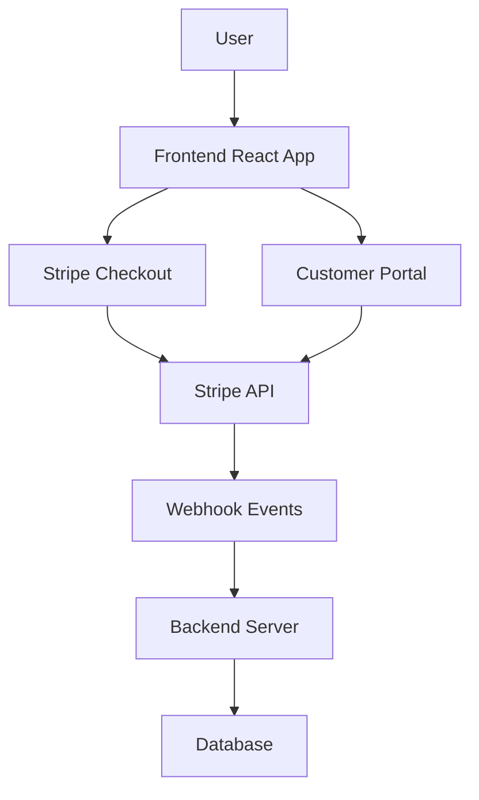
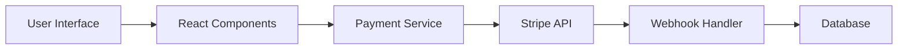
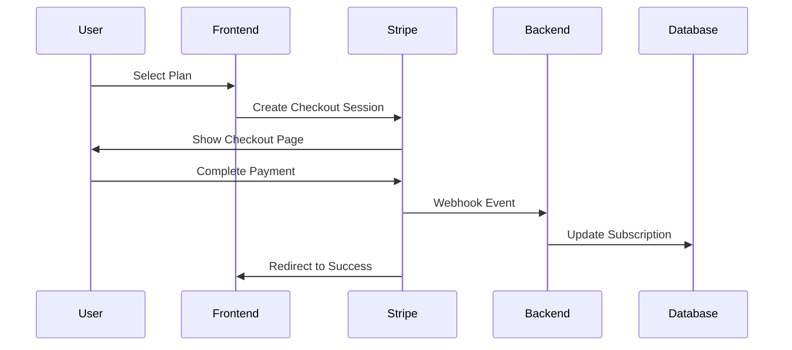
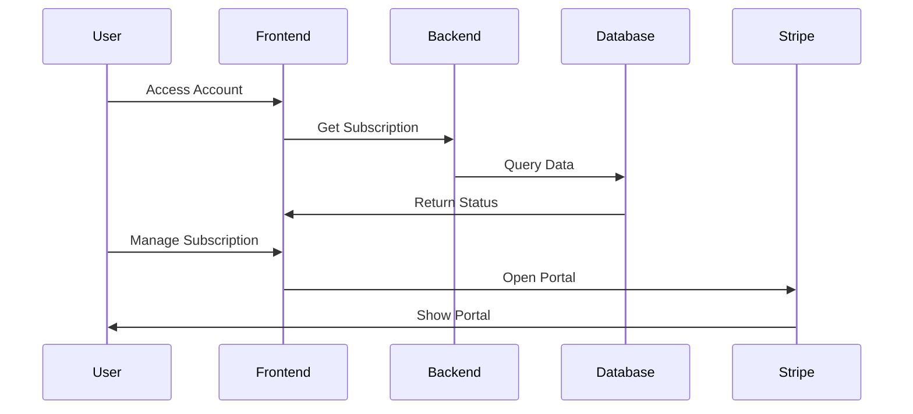
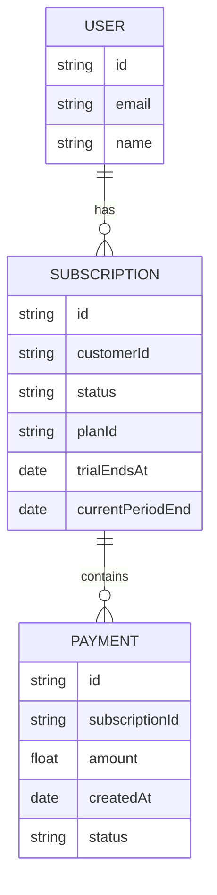
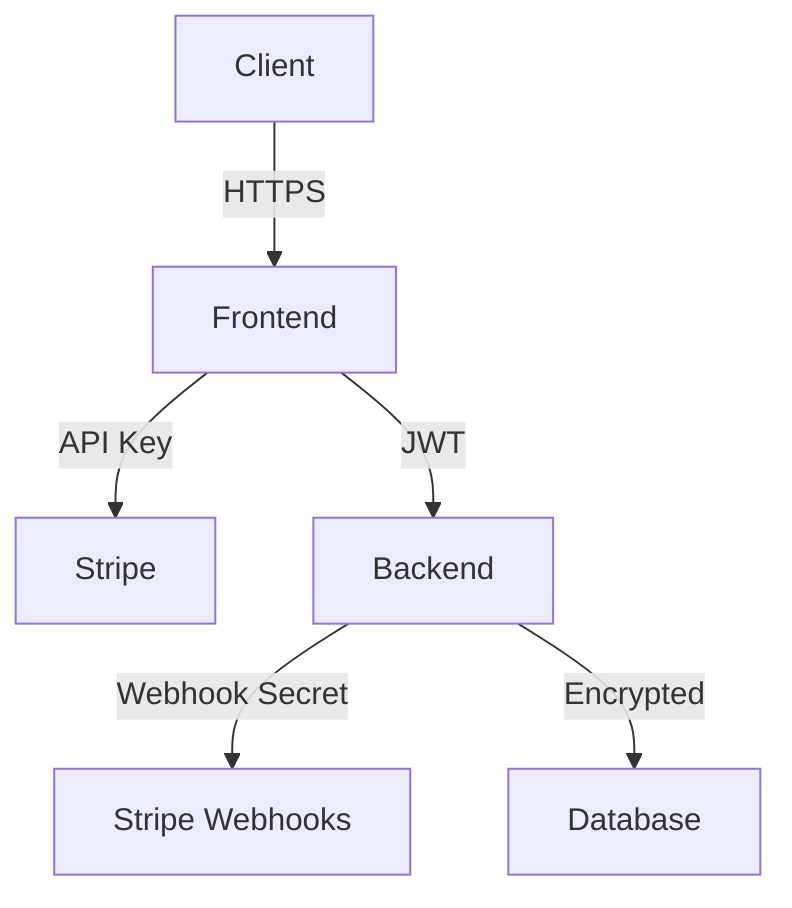
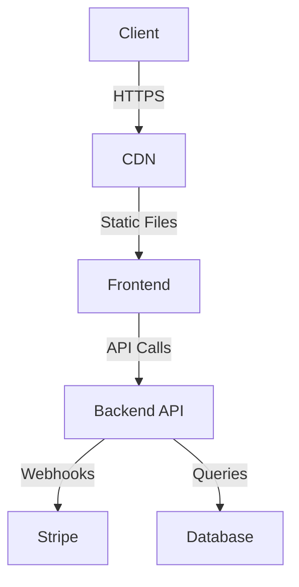
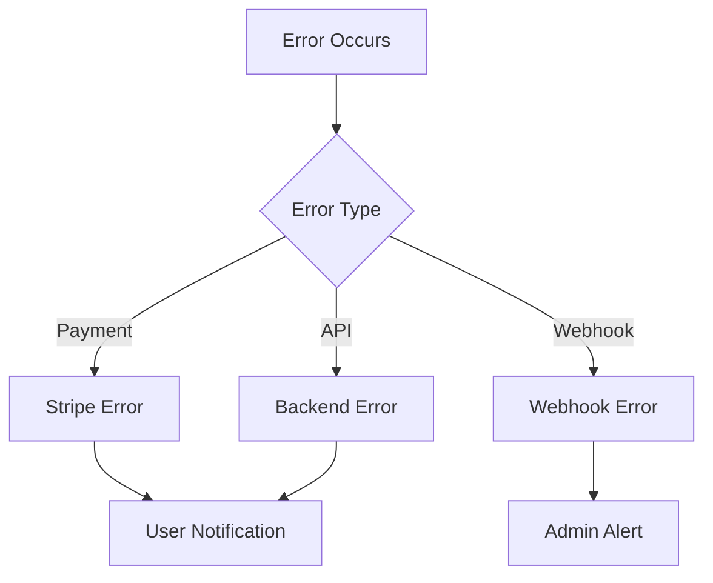
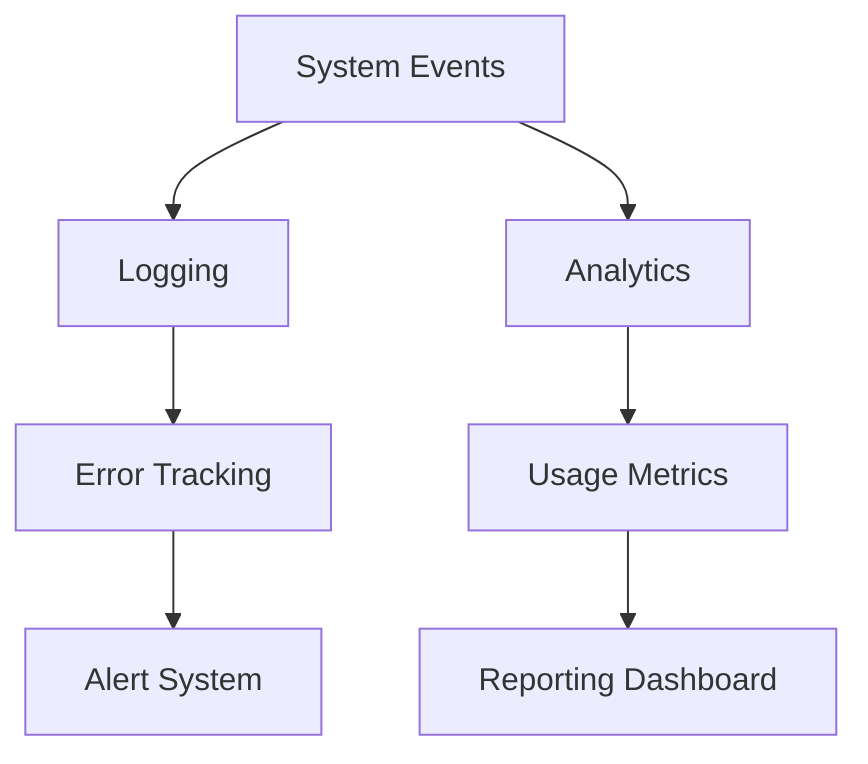

# Subscription System Architecture

## System Overview

## Component Architecture

## Data Flow

1. **Subscription Creation**

2. **Subscription Management**

## Database Schema

## Security Architecture

## Deployment Architecture

## Error Handling Flow

## Monitoring and Analytics

